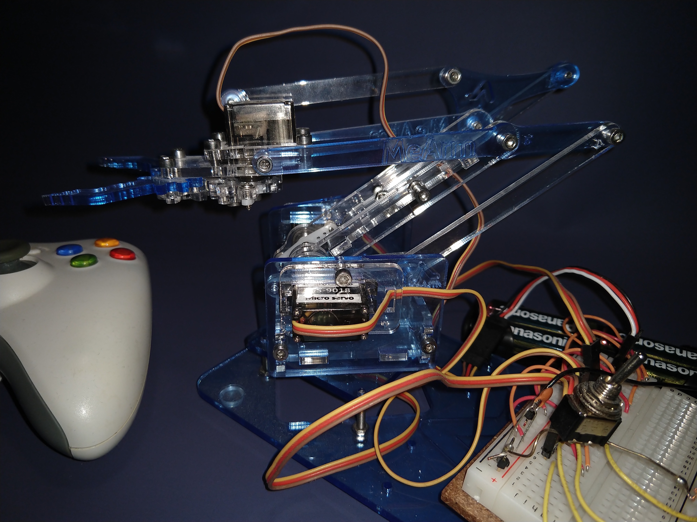

# robotic-arm-control

**German tutorial can be found [here](https://ckatins.de/2018/04/04/tischroboterarm.html)!**

This software makes is possible to control a small robotic arm with a GUI or a XBOX 360 controller.

It uses an Arduino and a MeArm Kit (which can be substituted by some 3D printed parts and 4 servos).

## The breadboard

## The arm itself

The processing code uses the [Game Control Plus](http://lagers.org.uk/gamecontrol/) Processing library to work with the XBOX controller.
